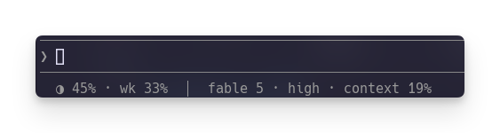

# claude-statusline

A minimal status line for [Claude Code](https://claude.com/claude-code): usage,
context, model, and reasoning effort, in one line.

```
◑ 24% · wk 28% · context 76%  │  sonnet · high
```

- `◑ 24%` — percent of your 5-hour usage window used
- `wk 28%` — percent of your 7-day usage window used
- `context 76%` — percent of the context window used in this session
- `sonnet · high` — active model and reasoning effort

Any field Claude Code doesn't report yet (rate limits, effort on models that
don't support it) is dropped instead of showing a broken placeholder.



## Install

One-liner (downloads `statusline.sh` and `install.sh` to a temp dir and runs
the installer):

```sh
tmpdir=$(mktemp -d) && curl -fsSL https://raw.githubusercontent.com/Merrick-work/claude-statusline/main/statusline.sh -o "$tmpdir/statusline.sh" && curl -fsSL https://raw.githubusercontent.com/Merrick-work/claude-statusline/main/install.sh -o "$tmpdir/install.sh" && chmod +x "$tmpdir/install.sh" && bash "$tmpdir/install.sh"
```

Or clone and run it yourself:

```sh
git clone https://github.com/Merrick-work/claude-statusline.git
cd claude-statusline
./install.sh
```

`install.sh`:

1. Copies `statusline.sh` to `~/.local/bin/claude-statusline.sh` (creating the
   directory if needed).
2. Merges a `statusLine` entry into `~/.claude/settings.json` (creating the
   file if needed), pointing it at that script.
3. Backs up any existing `~/.claude/settings.json` first, with a timestamped
   copy alongside it.
4. Refuses to touch a `statusLine` that already points somewhere else, unless
   you pass `--force`.

It's safe to run more than once: rerunning it just re-applies the same
config.

## What data this sees

Claude Code invokes `statusline.sh` with a small JSON object on stdin (model
name, effort level, context and rate-limit percentages) and reads the one
line it prints on stdout. The script makes no network calls, writes no files,
and sends nothing anywhere. Nothing leaves your machine.

## Uninstall

```sh
tmp=$(mktemp ~/.claude/.settings.json.XXXXXX) && jq 'del(.statusLine)' ~/.claude/settings.json > "$tmp" && mv "$tmp" ~/.claude/settings.json
rm ~/.local/bin/claude-statusline.sh
```

Or restore the timestamped backup `install.sh` printed when it ran:

```sh
cp ~/.claude/settings.json.bak.<timestamp> ~/.claude/settings.json
```

## Disclaimer

This is an unofficial, community-made tool. It is not affiliated with, or
endorsed or sponsored by, Anthropic. "Claude" is a trademark of Anthropic
PBC. This project reads only the local status line JSON that Claude Code
provides on stdin; it is not part of Claude Code itself.

Provided as-is, without warranty of any kind, express or implied. See
[LICENSE](LICENSE) (MIT) for the full terms.
